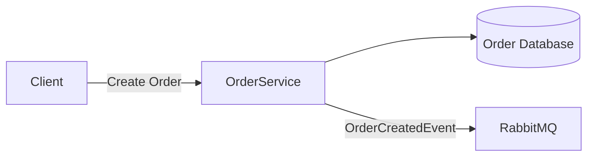
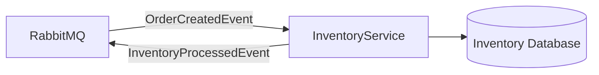
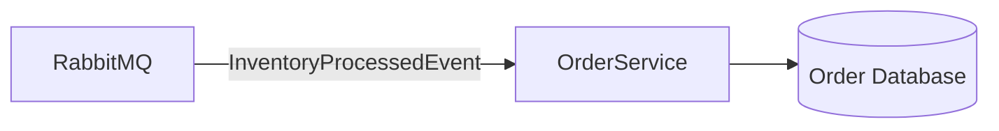

# distributedOrderProcessingSystem

A distributed order processing system built to explore microservices architecture, 
event-driven communication, and asynchronous messaging using RabbitMQ.

The goal of this project is to learn how independent services communicate through 
a message broker and handle distributed workflows.

## Tech Stack

- .NET
- RabbitMQ
- PostgreSQL
- Docker

---

# Architecture

The system uses an event-driven microservice architecture.

## Order Service

The Order Service is responsible for creating orders and publishing order events.


Example `OrderCreatedEvent`:

```json
{
    "UserId": "8b3f1d7e-6a9a-4d9f-bb8f-8c6b8f4c2e11",
    "OrderId": "9j3d1z7q-6a9a-4d9f-ba7f-8c6c8f4c2e22",
    "Items": [
        {
            "productId": "2a5c9e8f-7c41-4e2a-9b52-4d1e8c3f9012",
            "unitPrice": 89.99,
            "quantity": 1
        },
        {
             "productId": "6f9e2b44-3a1d-4c6b-a6d7-5e8f90123456",
             "unitPrice": 29.99,
             "quantity": 2
        }
    ]
}
```

## Inventory Service

The Inventory Service will consume `OrderCreatedEvent`, verify inventory availability, and publish an inventory processed event.


Example `InventoryProcessedEvent`:

```json
{
    "UserId": "8b3f1d7e-6a9a-4d9f-bb8f-8c6b8f4c2e11",
    "OrderId": "9j3d1z7q-6a9a-4d9f-ba7f-8c6c8f4c2e22",
    "Status": "Failed"
}
```

## Order Status Update

The Order Service will consume `InventoryProcessedEvent` and update the order status.



## Future Improvements

Inventory Service

Payment Service

Notification Service

Retry handling

Dead-letter queues

Idempotent message processing

Distributed tracing

Docker Compose setup
