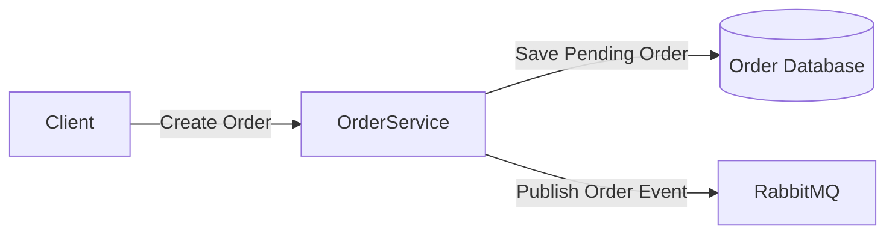
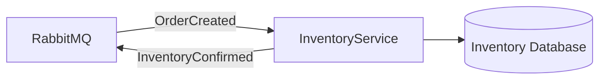

# distributedOrderProcessingSystem

A distributed order processing system built to explore microservices architecture, 
event-driven communication, and asynchronous messaging using RabbitMQ.

The goal of this project is to learn how independent services communicate through 
a message broker and handle distributed workflows.

## Tech Stack

- .NET
- RabbitMQ
- PostgreSQL
- Docker

---

# Architecture

The system uses an event-driven microservice architecture.

## Order Service

The Order Service is responsible for creating orders and publishing order events.



Example event:

```json
{
   "userId": "8b3f1d7e-6a9a-4d9f-bb8f-8c6b8f4c2e11",
   "orderItems": [
      {
         "productId": "2a5c9e8f-7c41-4e2a-9b52-4d1e8c3f9012",
         "productName": "Mechanical Keyboard",
         "unitPrice": 89.99,
         "quantity": 1
      },
      {
         "productId": "6f9e2b44-3a1d-4c6b-a6d7-5e8f90123456",
         "productName": "Wireless Mouse",
         "unitPrice": 29.99,
         "quantity": 2
      }
   ]
}
```

## Inventory Service

The Inventory Service will consume OrderCreated events and verify inventory availability.




## Future Improvements

Inventory Service

Payment Service

Notification Service

Retry handling

Dead-letter queues

Idempotent message processing

Distributed tracing

Docker Compose setup
